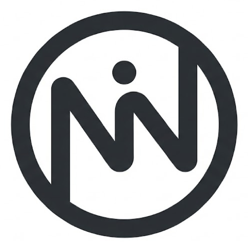

<p align="center">
  
</p>

<h1 align="center">NINAI</h1>

<p align="center">
  <strong>Networking Interface N AI</strong>
</p>

<p align="center">
  A local-first desktop app that unifies AI tools and note-taking into one seamless workspace.
</p>

<p align="center">
  
  
  
</p>

---

## Why NINAI?

Inspired by limitations in existing AI note-taking tools, developed NINAI to provide persistent note management while integrating multiple LLMs using users' own subscriptions — eliminating the need for separate API access.

### The Problem

Modern knowledge work involves constantly switching between AI tools (ChatGPT, Claude, Gemini, Perplexity) and your notes. Every AI interaction produces insights worth saving, but the workflow is fragmented:

- **Tab overload** — jumping between AI chats and note apps breaks concentration
- **Lost context** — AI responses vanish after you close the tab
- **Subscription waste** — paid AI tools force you to use *their* note system or buy API keys separately
- **No universal clipboard** — copying images from AI tools into notes is bizarrely difficult

### What NINAI Solves

NINAI places your AI tools and your notes **side-by-side in a single window**. Use ChatGPT, Claude, Gemini — any web-based LLM — with your existing subscriptions, and capture insights directly into a persistent, organized notebook.

| Without NINAI | With NINAI |
|---|---|
| Switch between 5+ browser tabs | One window, split view |
| Copy-paste from AI → Notes app | Drag, click, or paste — all in-app |
| Images fail to copy (CORS/hotlink) | **Super Copy** bypasses all restrictions |
| Notes lost across apps | Local-first, always available |
| Pay for API keys to integrate | Use your existing AI subscriptions |

---

## Features

- **⚡ Dual-Pane Workspace** — Browse any AI tool on one side, take notes on the other. Resize the split freely.
- **🧠 Multi-LLM Support** — Add ChatGPT, Claude, Gemini, Perplexity, or any web app as a sidebar tool. Login once; sessions persist.
- **🧘 Zen Mode** — Hide everything except the editor for distraction-free writing.
- **🖼️ Super Copy** — Right-click any image on the web and copy it into your notes, bypassing CORS and hotlink restrictions via Electron's native networking.
- **📄 Smart Paste** — Paste formatted text from any source; structure (headings, lists, code blocks) is preserved.
- **📂 Nested Folders** — Organize notes with drag-and-drop folders, subfolders, and search.
- **✅ Checklists & Tables** — Task lists, markdown tables, and rich formatting built in.
- **📤 Export** — Copy notes as Markdown (for AI context), or export as PDF.
- **💾 Backup & Restore** — Full ZIP backup/restore of all notes and folders.
- **🔒 100% Local** — All data stored on your device via IndexedDB. No cloud, no tracking, no accounts.

---

## Tech Stack

| Layer | Technology |
|---|---|
| Desktop Runtime | [Electron](https://www.electronjs.org/) 40 |
| UI Framework | [React](https://react.dev/) 19 + [TypeScript](https://www.typescriptlang.org/) 5.9 |
| Build Tool | [Vite](https://vite.dev/) 7 |
| Rich Text Editor | [TipTap](https://tiptap.dev/) 3 (ProseMirror) |
| Local Database | [Dexie.js](https://dexie.org/) 4 (IndexedDB) |
| Drag & Drop | [@dnd-kit](https://dndkit.com/) |
| Packaging | [electron-builder](https://www.electron.build/) |

---

## Getting Started

### Prerequisites

- **Node.js** 18+ — [Download](https://nodejs.org/)
- **npm** 9+ (comes with Node.js)
- **Git** — [Download](https://git-scm.com/)

**Platform-specific requirements for building:**

| Platform | Requirement |
|---|---|
| macOS | Xcode Command Line Tools (`xcode-select --install`) |
| Windows | Visual Studio Build Tools with C++ workload |
| Linux | `dpkg`, `fakeroot`, `rpm` packages for AppImage builds |

### Clone & Install

```bash
git clone https://github.com/PandiaJason/ninai.git
cd ninai
npm install
```

### Run in Development Mode

```bash
npm run desktop
```

This starts both the Vite dev server (with HMR) and the Electron app concurrently. The app opens automatically once the dev server is ready.

### Build for Production

**Build for your current platform:**

```bash
npm run dist
```

**Build for all platforms (macOS, Windows, Linux — x64 & arm64):**

```bash
npm run dist:all
```

> **Note:** Cross-compilation has limitations. Building Windows on macOS requires Wine. Building Linux on macOS requires Docker or a Linux VM. For best results, build each platform natively or use CI.

Release artifacts are output to the `release/` directory:

| Platform | Format | Architectures |
|---|---|---|
| macOS | `.dmg`, `.zip` | x64 (Intel), arm64 (Apple Silicon) |
| Windows | `.exe` (NSIS installer) | x64, arm64 |
| Linux | `.AppImage` | x64, arm64 |

---

## Project Structure

```
ninai/
├── electron/
│   ├── main.js          # Electron main process (window, IPC, context menus)
│   └── preload.js       # Secure bridge between renderer and main process
├── public/
│   ├── icon.png         # App icon
│   └── logo.png         # Logo for onboarding screen
├── src/
│   ├── components/
│   │   ├── Layout.tsx       # App shell with resizable panels
│   │   ├── Sidebar.tsx      # Tool switcher + user profile
│   │   ├── ToolView.tsx     # Webview wrapper for AI tools
│   │   ├── NotesPanel.tsx   # Notes editor (folders, list, TipTap editor)
│   │   ├── FolderList.tsx   # Drag-and-drop folder tree
│   │   ├── NotePreviewCard.tsx  # Note list item
│   │   └── Onboarding.tsx   # First-run setup screen
│   ├── hooks/
│   │   └── useDebounce.ts   # Debounce hook for note saves
│   ├── services/
│   │   └── llm.ts           # Markdown export/import utilities
│   ├── utils/
│   │   └── export.ts        # ZIP backup/restore logic
│   ├── data/
│   │   └── tools.ts         # Default AI tool configurations
│   ├── db.ts                # Dexie database schema & migrations
│   ├── App.tsx              # Root application component
│   ├── main.tsx             # React entry point
│   └── index.css            # Design system (CSS variables)
├── package.json
├── vite.config.ts
└── tsconfig.json
```

---

## Available Scripts

| Script | Description |
|---|---|
| `npm run desktop` | Start Electron + Vite dev server with hot reload |
| `npm run dev` | Start Vite dev server only (browser preview, no Electron) |
| `npm run build` | TypeScript check + Vite production build |
| `npm run dist` | Build + package for current platform |
| `npm run dist:all` | Build + package for macOS, Windows, and Linux |
| `npm run lint` | Run ESLint |

---

## Troubleshooting

### App shows "FATAL: electronAPI missing"
This means the app is running in a browser instead of Electron. Use `npm run desktop` instead of `npm run dev`.

### Quota database errors on startup
These are Chromium-level warnings and are harmless. They appear when Electron's internal storage cache is rebuilding.

### Build fails with native module errors
Run `npm rebuild` or delete `node_modules` and reinstall:
```bash
rm -rf node_modules package-lock.json
npm install
```

### macOS build shows "skipped code signing"
This is expected without an Apple Developer certificate. The app will still run but macOS Gatekeeper may warn users. For distribution, set up code signing via electron-builder docs.

---

## Contributing

1. Fork the repository
2. Create your feature branch (`git checkout -b feature/my-feature`)
3. Commit your changes (`git commit -m 'Add my feature'`)
4. Push to the branch (`git push origin feature/my-feature`)
5. Open a Pull Request

---

## License

MIT © [Jason P](https://github.com/PandiaJason)
